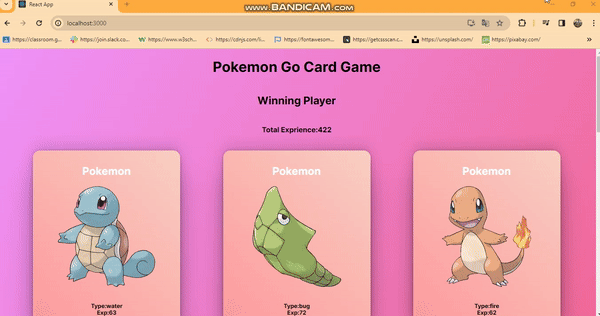

<h1> Pokemon-Go-Card-Game </h1>

This project is a simple and fun web application simulating a Pokemon card game, built using React.

<h2>Project Description</h2>

Pokemon Go Card Game represents a card game experience where players engage in battles between randomly selected Pokemon cards. Players determine the winner based on the experience points (base_experience) of their chosen cards.

<h2>Features</h2>

- Random selection of Pokemon cards.
- Battle experience points-based competition between players.
- Determination of the winner and visual feedback on the screen.

<h2>Technologies Used</h2>

->React
->JavaScript (ES6+)
->CSS (Styled Components)

<h2>Screenshots<h2>

